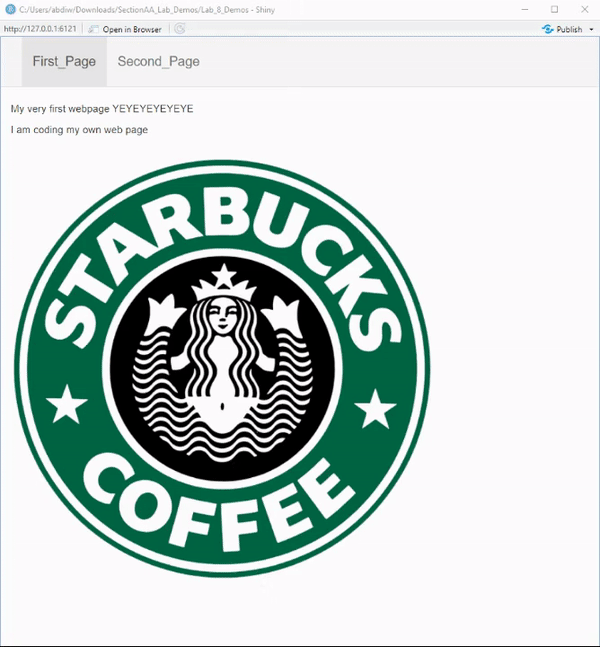

## Lab 8

Welcome in this lab and demo your going to be working on building webpages
Using shiny. In particular you will define  a server allowing users to be able
to modify a graph or other interactive components. And updating the user interface
to allow users to be able to access your web page. You will practice using R components
and using a large framework known as shiny to help you acheive  build these web pages.

To get started edit the included Lab_Demo_App.R, Lab_Demo_Server.R, and Lab_Demo_ui.R

To be able to build the web pages using shiny library and framework.

